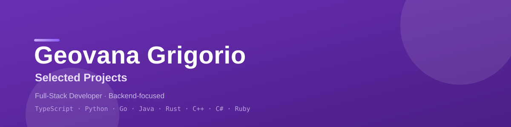

<!-- ══════════════════════ IDIOMAS / LANGUAGES ══════════════════════ -->

  
  
  
  
  
  
  
  

A curated index of my open-source work — production-style **APIs**, **web apps & dashboards**, **CLI tools** and **libraries**, spanning eight languages and their ecosystems. Every project ships with tests, a documented README, and (where applicable) green CI.

> 👋 I'm a full-stack developer focused on backend, clean APIs and data-driven services. Each entry below links to its own repository.

> 🔗 **See it all together in my portfolio:** **[geoggrigori.vercel.app](https://geoggrigori.vercel.app)**

---

## 🔌 Backend & APIs

| Project | What it does | Stack | Tests |
|---|---|---|:--:|
| **[collections-api](https://github.com/geoggrigori/collections-api)** | Accounts-receivable / collections automation API for distributors — payments, background-job ETL and LLM-powered remittance matching | `Rails` · `PostgreSQL` | — |
| **[ratewise-api](https://github.com/geoggrigori/ratewise-api)** | Production-grade token-bucket rate limiter middleware for Express APIs | `TypeScript` · `Express` |  |
| **[ttlcache](https://github.com/geoggrigori/ttlcache)** | Concurrency-safe in-memory key-value cache with per-key TTL, over HTTP | `Go` · `net/http` |  |
| **[library-api](https://github.com/geoggrigori/library-api)** | Spring Boot REST API with JPA, H2, validation and a borrow/return workflow | `Java` · `Spring Boot` |  |
| **[tasks-api-dotnet](https://github.com/geoggrigori/tasks-api-dotnet)** | Clean .NET Minimal API with EF Core, validation, Swagger and integration tests | `C#` · `.NET` |  |
| **[linkforge-api](https://github.com/geoggrigori/linkforge-api)** | URL shortener & analytics API with JWT auth, rate limiting, caching and Docker | `FastAPI` · `Docker` | — |

## 🖥️ Web Apps & Dashboards

| Project | What it does | Stack | |
|---|---|---|:--:|
| **[gamematch](https://github.com/geoggrigori/gamematch)** | Mobile-first matchmaking app for gamers — swipe, match and chat | `React` · `Supabase` · `Capacitor` | |
| **[collections-dashboard](https://github.com/geoggrigori/collections-dashboard)** | Accounts-receivable dashboard — front-end for the Collections API | `Next.js` · `React` | |
| **[revenue-analytics](https://github.com/geoggrigori/revenue-analytics)** | Sales analytics dashboard — KPIs, SVG charts, channel breakdown | `Next.js` · `TypeScript` | |
| **[pulse-dashboard](https://github.com/geoggrigori/pulse-dashboard)** | Realtime metrics dashboard — WebSocket streaming, hand-built SVG charts | `React` · `WebSocket` | |
| **[ar-copilot](https://github.com/geoggrigori/ar-copilot)** | LLM-powered collection-email drafter for overdue invoices | `Next.js` · `LLM` | |
| **[docchat-ai](https://github.com/geoggrigori/docchat-ai)** | RAG app: chat with your documents — BM25 retrieval + streaming cited answers | `Next.js` · `RAG` | |
| **[marknote](https://github.com/geoggrigori/marknote)** | Fast Markdown notes app with live preview, search and dark mode | `React` · `Vite` |  |

## 🛠️ CLI & Data Tools

| Project | What it does | Stack | Tests |
|---|---|---|:--:|
| **[envguard](https://github.com/geoggrigori/envguard)** | Validates environment variables against a declarative TOML schema (CI-friendly) | `Python` · `zero-deps` |  |
| **[exprcalc](https://github.com/geoggrigori/exprcalc)** | Arithmetic expression evaluator: lexer + recursive-descent parser + REPL | `Rust` · `zero-deps` |  |
| **[insight-pipeline](https://github.com/geoggrigori/insight-pipeline)** | Data pipeline: ingest CSV/API, aggregate, detect trends and auto-generate reports | `Python` · `pandas` | — |

## 📦 Libraries & Data Structures

| Project | What it does | Stack | Tests |
|---|---|---|:--:|
| **[lru-cache-cpp](https://github.com/geoggrigori/lru-cache-cpp)** | Header-only, templated O(1) LRU cache for modern C++17 | `C++17` · `CMake` |  |

---

## 🧰 Tech across these projects

**Languages:** TypeScript · JavaScript · Python · Go · Java · Rust · C++ · C# · Ruby
**Backend:** Node/Express · FastAPI · Spring Boot · ASP.NET Minimal API · Rails · net/http
**Frontend:** React · Next.js · Vite · Tailwind CSS
**Data & infra:** PostgreSQL · H2 · EF Core · JPA · Supabase · Docker · pandas · WebSocket
**Quality:** Vitest · pytest · JUnit · xUnit · CTest · `go test -race` · GitHub Actions CI

## 📫 Connect

- **Portfolio:** [geoggrigori.vercel.app](https://geoggrigori.vercel.app)
- **GitHub:** [@geoggrigori](https://github.com/geoggrigori)
- **LinkedIn:** [in/geoggrigori](https://linkedin.com/in/geoggrigori)
